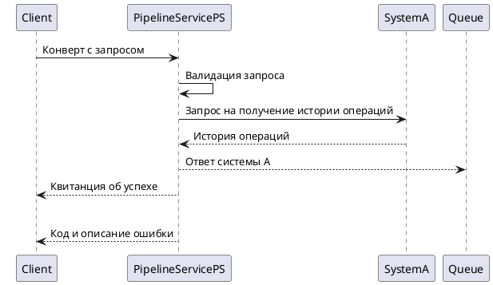

# Описываем README.md

README.md - важный файл в репозитории сервиса. 
Он позволяет быстро понять назначение сервиса, сориентировать по его установке и функционалу.
Правильный README.md сэкономит время потребителям сервиса, новым сотрудникам и другим разработчикам, которым потребуется внести в этот сервис изменения. 

README.md должен содержать следующие основные разделы: 
* Назначение сервиса,
* Краткое описание процесса, реализованного в сервисе,
* Навигация (особенно необходимо, если сервис сложный и содержит несколько .md файлов с описанием работы сервиса или спецификаций .yaml/.json),
* Контактная информация авторов сервиса. 

> Описание в файле README.md должно быть простым, лаконичным в функциональном стиле.
> Важно не усложнять, а все описание по возможности снабдить небольшими семами с использованием plantuml или mermaid.

## Назначение сервиса 
В разделе стоит кратко указать какую задачу решает данный сервис и к какому домену относится. 
Вот пример хорошего наполнения этого раздела: 

```markdown
Сервис является синхронным перекладчиком запросов систем-потребителей в системы-поставщики. 
Запросы поступают из систем-потребителей по очередям и обрабатываются сервисом-поставщиком согласно обобщенному бизнес-процессу:
* запросы из очереди направляются синхронно по REST в соответствующую систему;
* полученный ответ упаковывается в ответный конверт и отправляется в очередь ответа.
```

## Описание процесса
В разделе стоит указать. какие функции реализованы в сервисы и что происходит по процессу от поступления запроса в сервис до его завершения.
Тут будет уместна схема в формате plantuml или mermaid (картинку .jpg, .png, .svg и т.д. лучше не использовать, в картинку такого формата будет крайне сложно внести изменения в будущем). 

Вот пример хорошего наполнения этого раздела:
```markdown
>Обработка запроса из Платежной Системы (PipelineServicePS)
>* получает конверт с запросом;
>* валидирует входящий запрос;
>* отправляет квитанцию о результате валидации и принятии запроса;
>* отправляет запрос на получение истории операций в Систему А (REST);
>* отправляет полученный ответ в очередь;
>* отправляет квитанцию об успехе либо ошибки обработки запроса.
```



Поддерживать  jписание в файле README.md в актуальном состоянии. 

Желательно с использованием схем в формате plantuml.